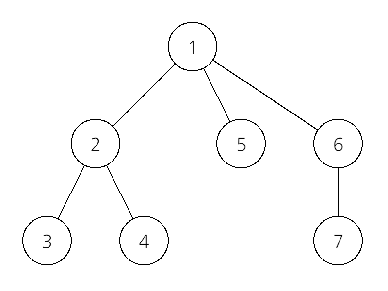
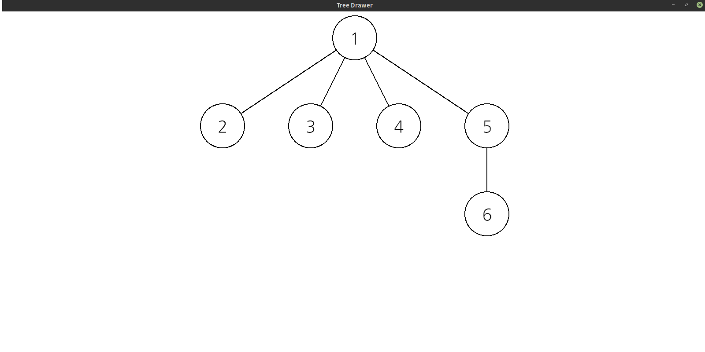

# tree-drawer

트리를 텍스트로 입력받아서 그림으로 그려 줍니다.

### Build

tree-drawer를 컴파일하기 위해서는 [Rust가 설치](https://www.rust-lang.org/)되어 있어야 합니다.

```
$ git clone https://github.com/kimjy0126/tree-drawer
$ cd tree-drawer
$ cargo build --release
```

바이너리 파일은 `target/release/` 디렉토리에 `tree-drawer`라는 이름으로 생성됩니다.

### Explanation of Input

tree-drawer는 표준 입력으로 정해진 형식에 따라 텍스트로 쓰여진 트리를 새 창에 그림으로 그려서 보여 줍니다.

트리는 다음과 같이 재귀적으로 텍스트화됩니다 (소괄호 `()`는 텍스트에 포함되지 않습니다):

`[(root의 값)(subtree1)(subtree2)(subtree3)...]`

몇 가지 예시를 통해 알아 봅시다.

#### 예시 1


노드 3개로 이루어진 간단한 트리입니다. root의 값이 1이고, root의 child 노드가 2개이므로 위 트리는 다음 텍스트로 변환될 수 있습니다:

`[1(subtree1)(subtree2)]`

root의 child 노드를 root로 하는 subtree에 대해 위 과정을 반복하면, 전체 트리는 다음과 같이 변환됩니다:

`[1[2][3]]`

#### 예시 2



이번엔 조금 더 복잡한 트리입니다. root의 값이 1이고, root의 child 노드가 3개이므로 위 트리는 일단 다음 텍스트로 변환될 수 있습니다:

`[1(subtree1)(subtree2)(subtree3)]`

subtree1은 root의 값이 2이고, root의 child 노드가 2개이므로(이 두 child 노드를 root로 하는 트리를 편의상 subtree11, subtree12라고 합시다) 주어진 트리는 다시 다음 텍스트로 변환될 수 있습니다:

`[1[2(subtree11)(subtree12)](subtree2)(subtree3)]`

subtree11은 root의 값이 3이고 root의 child노드가 없으므로 그대로 `[3]`으로 변환됩니다. 이 때 주어진 트리는 다음 텍스트로 변환됩니다:

`[1[2[3](subtree12)](subtree2)(subtree3)]`

모든 subtree들에 대해 위 과정을 반복하면, 전체 트리는 다음과 같이 변환됩니다:

`[1[2[3][4]][5][6[7]]]`

### Usage

위에서 언급했듯이, tree-drawer는 표준 입력으로 텍스트화된 트리를 입력받습니다.

```
$ pwd
(INSTALLATION_PATH)/tree-drawer
$ cd target/release
$ ./tree-drawer
[1[2][3][4][5[6]]]
```

표준 입력으로 올바른 트리를 입력하면, tree-drawer는 트리를 그림으로 그려 새 창으로 보여줍니다!



### TODO

1. 올바르지 않은 입력에 대해 에러 처리가 제대로 되지 않습니다.
2. 글씨 위치를 더 세밀하게 조정해야 합니다. 특히, 노드의 값의 길이가 긴 경우 노드 크기 밖으로 벗어나는 경우도 있습니다!
3. 폰트 선택, 노드 크기 선택 등 사용자 취향에 맞게 옵션을 넣어 볼 생각입니다.
